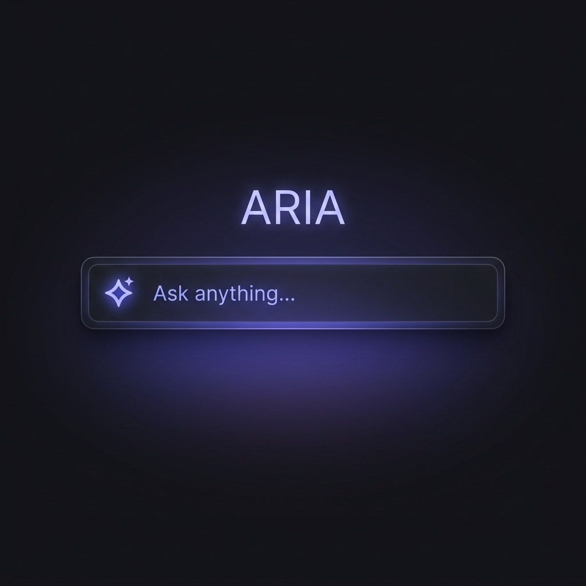
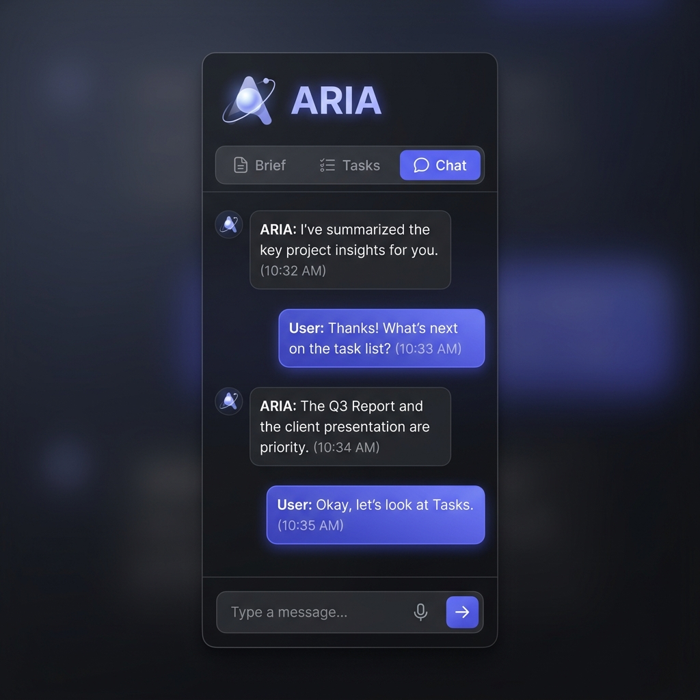

<div align="center">



<br/>
<br/>

# ARIA

### Personal AI Operating System for Windows

**The era of the assistant is over.**

<br/>


<br/>

*"Alt + Space. Whisper your intent. Let the orchestra handle the rest."*

</div>

---

## What is ARIA?

ARIA is not a chatbot. Not a search wrapper. Not a Siri clone.

It is the **intelligence layer between you and your computer** — a Personal AI Operating System that lives on your desktop, understands your context, controls your machine, runs tasks in the background, and knows you better than any cloud service ever could.

ARIA evolved from [FRIDAY Synapse](https://github.com/codedbyOzzy/ProjectFridaySynapse), a 7-stone cognitive architecture that proved the concept but revealed a critical limitation: intelligence is useless when it's slow.

**ARIA is the answer.**

---

## The Evolution: FRIDAY → ARIA

FRIDAY's event-bus architecture was a cognitive laboratory. Seven stones, each brilliant in isolation, chained together in a sequential pipeline that punished every query with 10–30 seconds of latency.

ARIA shatters that chain.

| | FRIDAY Synapse (v1.x) | ARIA Core (v2.0) |
|---|---|---|
| **Architecture** | 8 Stones + Event Bus | 3 Services + Direct Async |
| **First Response** | 10s – 30s | **< 1.2s** |
| **Fast Queries** (time, date) | 2–4s | **< 80ms** |
| **Tool Calls** | 8–15s | **< 3s** |
| **UI Feedback** | Full response waited | **Token-by-token streaming** |
| **TTS** | After full response | **Sentence-by-sentence** |
| **LLM Providers** | OpenAI only | OpenAI, Anthropic, Gemini, Groq, Ollama |

---

## Core Architecture v2.0

```
┌─────────────────────────────────────────────────────────────┐
│                         ARIA CORE                           │
│                                                             │
│  ┌──────────────┐  ┌─────────────────┐  ┌───────────────┐  │
│  │ InputEngine  │  │   AgentCore     │  │  OutputBus    │  │
│  │              │  │                 │  │               │  │
│  │ • Alt+Space  │→ │ • LLMClient     │→ │ • Stream UI   │  │
│  │ • STT opt.   │  │ • Tool executor │  │ • TTS pipe    │  │
│  │ • Intent cls │  │ • Context inject│  │ • Notif       │  │
│  │ • Fast path  │  │ • Stream split  │  │ • File out    │  │
│  └──────────────┘  └─────────────────┘  └───────────────┘  │
│                                                             │
│  ┌─────────────────────────────────────────────────────┐   │
│  │  MemoryEngine (runs in parallel)                     │   │
│  │  • Personal Knowledge Base (SQLite + vector)         │   │
│  │  • Session context + auto-extraction                 │   │
│  └─────────────────────────────────────────────────────┘   │
│                                                             │
│  ┌─────────────────────────────────────────────────────┐   │
│  │  BackgroundScheduler                                  │   │
│  │  • Task queue (SQLite) • Cron trigger                │   │
│  │  • Windows Toast notifications                        │   │
│  └─────────────────────────────────────────────────────┘   │
└─────────────────────────────────────────────────────────────┘
```

The key engineering insight: `MemoryEngine` and `AgentCore` now start **in parallel** the moment input is received. By the time the LLM needs context, it's already there.

```python
async def handle_input(text: str):
    memory_task = asyncio.create_task(memory.get_context(text))  # starts immediately
    intent = classify_intent(text)                                 # instant, local
    if intent.is_fast_path:
        return fast_answer(intent)                                 # < 80ms
    context = await memory_task                                    # already done
    async for token in agent.stream(text, context):               # first token < 1.2s
        ui.append_token(token)
```

---

## The Interface

<div align="center">



</div>

<br/>

ARIA operates across three seamless layers. **Omnipresent. Never Intrusive.**

| Mode | Trigger | Purpose |
|---|---|---|
| **Ambient** | Always active | System tray presence. Monitors context. Runs background tasks. |
| **Bar Mode** | `Alt + Space` | Instant query surface. Opens in < 100ms. Closes on `Esc`. |
| **Panel Mode** | `Tab` from Bar | Expanded view. Brief tab, Tasks tab, Chat history. |

### Bar Mode Design

```
Alt+Space →

┌────────────────────────────────────────────────────────────┐
│                                                            │
│  ◈  Ask anything...                          ⌘K      ⟳   │  ← 72px
│                                                            │
└────────────────────────────────────────────────────────────┘
              600px, centered, glass background

Response expands below with spring animation:
┌────────────────────────────────────────────────────────────┐
│  ◈  what should I prepare for tomorrow's meeting           │
├────────────────────────────────────────────────────────────┤
│                                                            │
│  You have a strategy meeting at 14:00 with ABC.            │
│  Based on your last 2 conversations about this...  [→ Full]│
└────────────────────────────────────────────────────────────┘
```

---

## Context-Aware Intelligence

ARIA monitors your clipboard silently. When you open Bar Mode, it already knows what you're working on.

| Clipboard Content | Suggested Actions |
|---|---|
| 🔗 **URL** | `Summarize` · `Research` · `Share` |
| 💻 **Code** | `Debug` · `Explain` · `Improve` |
| 📝 **Text** | `Rewrite` · `Translate` · `Analyze` |
| 📅 **Meeting soon** | `Prepare briefing` |
| ☀️ **Morning (7–9am)** | `Daily brief` |

---

## Bring Your Own Key (BYOK)

ARIA has no subscription. No data sent to our servers. You connect your own AI providers directly.

```python
PROVIDERS = {
    "openai":    OpenAIAdapter,    # GPT-4o, GPT-4o-mini, GPT-4.1
    "anthropic": AnthropicAdapter, # Claude Opus 4, Sonnet 4.5
    "google":    GeminiAdapter,    # Gemini 2.5 Pro/Flash
    "groq":      GroqAdapter,      # Llama 3.3 70B — ultra-fast
    "ollama":    OllamaAdapter,    # Local model — full privacy
}
```

Configure once: choose your primary model, a complex-task model, and a fallback. ARIA routes intelligently based on query complexity.

---

## The 7 Stones — Harmonized

FRIDAY's 7-stone cognitive architecture is not discarded. It is **unified**. Each stone's intelligence is absorbed into ARIA's three-service core:

| Stone | Original Role | ARIA Integration |
|---|---|---|
| **THE ARC** | Narrative memory & episodic tracking | → MemoryEngine persistent KB |
| **SPECTRE** | Predictive awareness & state tracking | → AgentCore context injection |
| **ORACLE** | Model routing decisions | → LLMClient inline classification |
| **EchoStone** | Retrieval & comprehension signals | → MemoryEngine parallel search |
| **MindStone** | Personality & tone adaptation | → AgentCore system prompt |
| **VoiceStone** | Speech I/O | → InputEngine STT + OutputBus TTS |
| **ActionStone** | Desktop tool execution | → AgentCore tool executor |

---

## Capabilities

### Desktop Control
- Open, close, and manage Windows applications
- File system operations, clipboard management, system stats
- Browser workflows, reminders, media control

### Memory & Adaptation
- Persistent personal knowledge base across all sessions
- Narrative tracking: remembers conversations from 3 months ago
- Automatic preference and context extraction
- Morning briefing generation

### Multi-Model Intelligence
- Fast path: instant answers for simple queries (< 80ms)
- Deep path: complex reasoning with full context
- Local path: full privacy with Ollama
- Automatic failover between providers

### Voice-First (Optional)
- Speech-to-text via Groq Whisper
- Sentence-by-sentence neural TTS — voice starts before response completes
- Turkish and English support

---

## What This Repository Is

**ARIA** is the public architecture showcase for a private Windows AI OS built by [Synapse Labs](https://github.com/codedbyOzzy).

This repository documents:
- Product vision and design philosophy
- Core v2.0 architecture and engineering decisions
- The FRIDAY → ARIA evolution story
- Public module references and roadmap

It does **not** include private runtime code, API keys, personal memory files, automation internals, or production secrets.

See [ARCHITECTURE.md](ARCHITECTURE.md) · [ROADMAP.md](ROADMAP.md) · [PRIVACY.md](PRIVACY.md)

---

## Repository Guide

| File | Purpose |
|---|---|
| [ARCHITECTURE.md](ARCHITECTURE.md) | Core v2.0 technical deep-dive |
| [ROADMAP.md](ROADMAP.md) | Sprint plan and feature timeline |
| [SHOWCASE.md](SHOWCASE.md) | Real-world usage scenarios |
| [PUBLIC_MODULES.md](PUBLIC_MODULES.md) | Public vs private boundary |
| [PRIVACY.md](PRIVACY.md) | Privacy, data, and security posture |
| [CHANGELOG.md](CHANGELOG.md) | Version history |

---

<div align="center">

<br/>

**Built for the future by Synapse Labs. 2026.**

</div>
