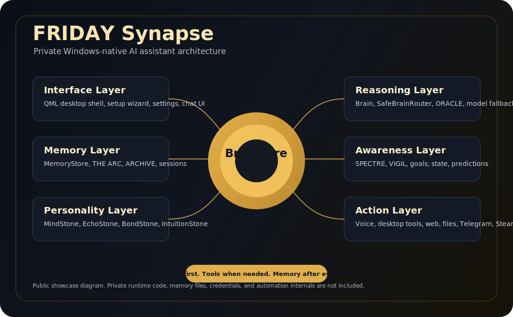
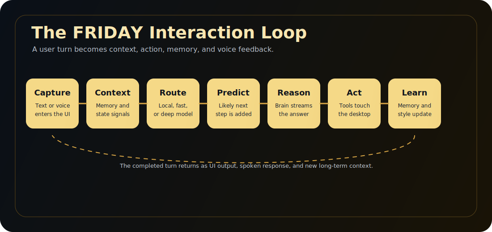

# FRIDAY Synapse

### Windows için özel bir yapay zeka asistan mimarisi vitrini

**Kalıcı hafıza. Sesli etkileşim. Masaüstü kontrolü. Çok modelli akıl yürütme.**

 

 

*"Bir sohbet sekmesi değil. Basit bir prompt arayüzü değil. FRIDAY, işletim sistemiyle birlikte yaşayan kalıcı bir asistan olarak tasarlandı."*

---

## Bu Repo Nedir?

**ProjectFridaySynapse**, [Ozzy](https://github.com/codedbyOzzy) tarafından geliştirilen özel FRIDAY Windows masaüstü asistanının herkese açık vitrin reposudur.

Bu repo FRIDAY'in ürün fikrini, bilişsel mimarisini, public/private sınırını, gizlilik yaklaşımını ve yol haritasını anlatır. Özel runtime kodunu, API anahtarlarını, kişisel hafıza dosyalarını veya hassas otomasyon detaylarını paylaşmaz.

Özel FRIDAY runtime'ı şunları bir araya getirir:

- PySide6/QML tabanlı Windows masaüstü arayüzü
- Sürekli ses girişi ve nöral metinden sese dönüşüm
- OpenAI, Gemini, Groq ve yerel LLM fallback destekli çok modelli akıl yürütme
- Kalıcı hafıza, oturum geçmişi, anlatı takibi ve kullanıcıya uyum
- Uygulamalar, dosyalar, pano, tarayıcı, Steam, Telegram, sistem bilgisi ve hatırlatıcılar için masaüstü araçları
- FRIDAY "Stone" modülleri etrafında kurulu olay tabanlı mimari

 

---

## Bu Repo Ne Değildir?

Bu repo özel FRIDAY kaynak kod deposu değildir.

Şunları içermez:

- Özel asistan runtime kodu
- API anahtarları veya kişisel veri içeren promptlar
- Kullanıcı hafızası, oturum kayıtları veya yerel ayarlar
- Hassas masaüstü otomasyonu iç detayları
- Üretim sırları veya kişiye özel model yönlendirme politikaları

FRIDAY yerel öncelikli bir kişisel asistandır. Bu yüzden public vitrin ile private runtime bilinçli olarak ayrılmıştır.

Daha fazla bilgi için [PRIVACY.md](PRIVACY.md) ve [PUBLIC_MODULES.md](PUBLIC_MODULES.md) dosyalarına bakabilirsin.

---

## Sistem Özeti

FRIDAY tek bir sohbet döngüsü değil, katmanlı bir asistan işletim katmanı gibi tasarlanmıştır.

| Katman | Görev | Örnek Modüller |
|---|---|---|
| Arayüz Katmanı | Masaüstü UI, kurulum, ayarlar, sohbet yüzeyi | PySide6, QML, Setup Wizard |
| Olay Katmanı | Modüller arası event yönlendirme | BrainCore, StoneEvent |
| Akıl Yürütme Katmanı | Model seçimi, streaming cevap, tool calling | Brain, SafeBrainRouter, ORACLE |
| Hafıza Katmanı | Gerçekler, hedefler, bölümler ve kararlar | MemoryStore, THE ARC, ARCHIVE |
| Farkındalık Katmanı | Sonraki adımı ve kullanıcı durumunu tahmin etme | SPECTRE, VIGIL |
| Kişilik Katmanı | Ton, tarz ve kullanıcı dünya modeline uyum | MindStone, EchoStone, BondStone, IntuitionStone |
| Aksiyon Katmanı | Masaüstü, web, ses ve dosya eylemleri | Tools, VoiceStone, ActionStone, WebStone |

---

## Etkileşim Döngüsü

Her kullanıcı mesajı bağlam açısından zengin bir döngüden geçer:

| Adım | Modül | Ne Olur? |
|---|---|---|
| 1. Yakala | VoiceStone / UI Bridge | Metin veya ses alınır ve kullanıcı eventi yayınlanır |
| 2. Bağlam | EchoStone / Memory | İlgili hafızalar ve anlama sinyalleri toplanır |
| 3. Yönlendir | SafeBrainRouter / ORACLE | Yerel, hızlı bulut veya derin akıl yürütme yolu seçilir |
| 4. Tahmin Et | SPECTRE / VIGIL | Olası sonraki adım ve anlık durum bağlamı eklenir |
| 5. Düşün | Brain | Cevap stream edilir, gerekiyorsa araç çağrılır |
| 6. Eylem Yap | Tools | Uygulama açma, dosya okuma, web arama, Windows kontrolü yapılır |
| 7. Öğren | Memory / Stones | Faydalı gerçekler, stil sinyalleri, hedefler ve sonuçlar kaydedilir |
| 8. Konuş | TTS / UI | Son cevap arayüzde gösterilir ve seslendirilir |

---

## Yetenekler

### Yerel Masaüstü Asistanı

- Windows uygulamalarını açma ve kapatma
- Pencere, pano, dosya, klasör ve sistem bilgisi yönetimi
- Ses, medya, hatırlatıcı ve hızlı not kontrolü
- Tarayıcı, YouTube, Steam ve Telegram iş akışları
- Bırakılan dosyaları okuyup ilgili bölümleri özetleme

### Ses Odaklı Kullanım

- Yerel ses döngüsü ve konuşmadan metne dönüşüm
- Edge tabanlı nöral sesler
- Echo azaltma ve barge-in güvenlikleri
- Türkçe ve İngilizce destek

### Hafıza ve Uyum

- Oturumlar arasında kalıcı kullanıcı hafızası
- Gerçek, hedef, tercih, olay ve bağlam kategorileri
- THE ARC ile episodik anlatı takibi
- ARCHIVE ile uzun vadeli profil ve duygusal bağlam
- MindStone ve EchoStone ile iletişim tarzı adaptasyonu

### Çok Modelli Zeka

- Günlük kullanım için hızlı akıl yürütme yolu
- Analiz, debug ve planlama için derin akıl yürütme yolu
- Basit ve güvenli sorgular için yerel model yolu
- Gemini ve Groq fallback katmanları
- Provider dayanıklılığı için circuit-breaker yaklaşımı

---

## Public Ekosistem

Bazı FRIDAY fikirleri bağımsız modül veya mimari referans olarak public tutulabilir:

- [Intelligence Stones](https://github.com/codedbyOzzy/Intelligence-Stones) - adaptif persona ve bilişsel modüller
- [THESingularity](https://github.com/codedbyOzzy/THESingularity) - public awareness-layer çalışmaları
- [FRIDAY Showcase](https://showcasefridayv2.netlify.app) - görsel ürün vitrini

Tam Windows asistan runtime'ı private kalır.

---

## Repo Rehberi

| Dosya | Amaç |
|---|---|
| [README.md](README.md) | İngilizce ana vitrin |
| [ARCHITECTURE.md](ARCHITECTURE.md) | Üst seviye teknik mimari |
| [ROADMAP.md](ROADMAP.md) | Güncel yön ve planlanan işler |
| [SHOWCASE.md](SHOWCASE.md) | Örnek kullanım senaryoları |
| [PUBLIC_MODULES.md](PUBLIC_MODULES.md) | Public/private modül sınırı |
| [PRIVACY.md](PRIVACY.md) | Gizlilik, veri ve güvenlik duruşu |
| [CHANGELOG.md](CHANGELOG.md) | Public showcase güncelleme geçmişi |

---

## Güncel Durum

FRIDAY şu anda **private beta masaüstü asistanı** olarak geliştiriliyor. Bu repo, sistemin public ürün ve mimari vitrini olarak tutuluyor.

Amaç sade: güçlü kişisel yapay zekayı yerel, kalıcı, kullanışlı ve masaüstüne ait hissettirmek.

 

**Built by [Ozzy](https://github.com/codedbyOzzy)**

